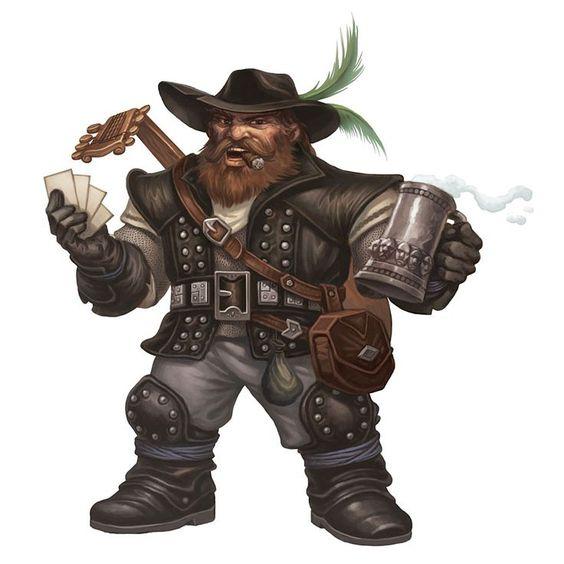
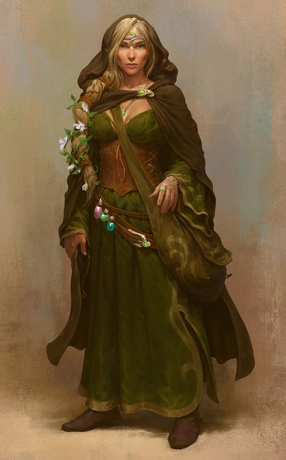
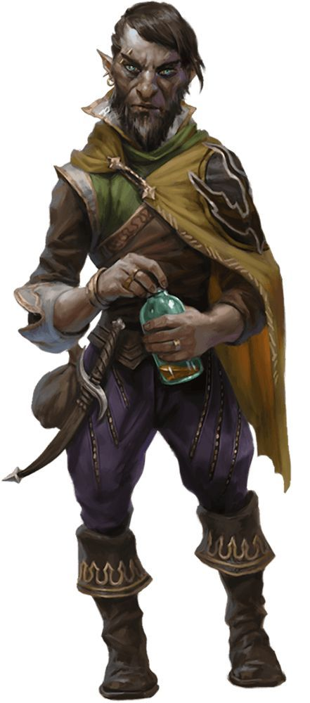
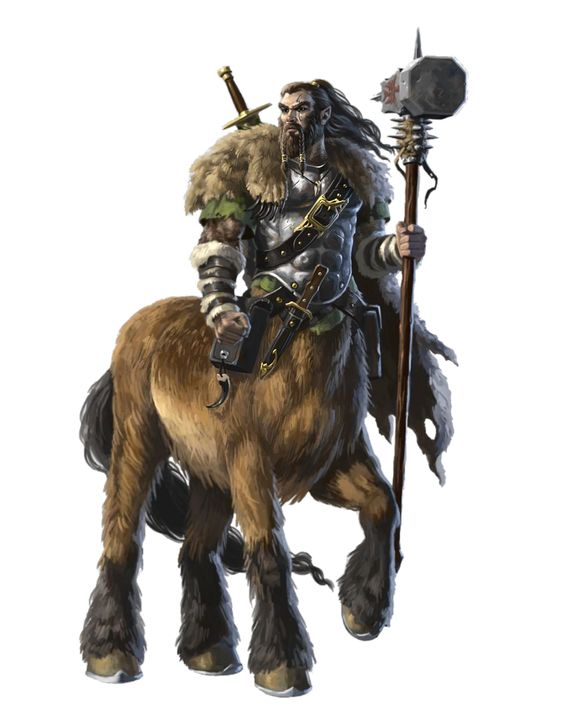
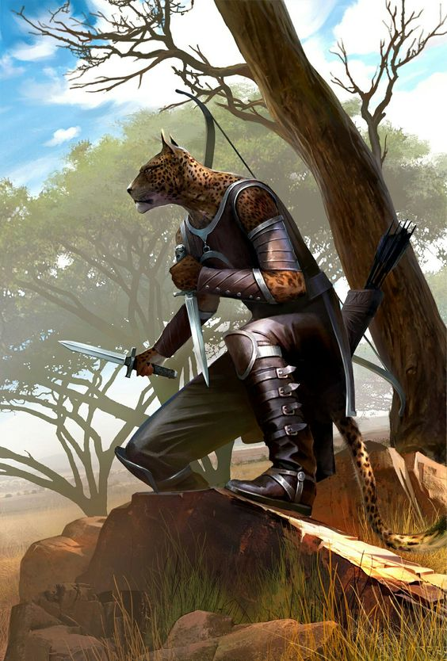

# The Life & Travels of Finnigan Fernkeep

## Table of Contents
- [Finnigan Fernkeep](#finnigan)
    * [Physical](#description)
    * [Mechanical](#stats)
    * [Story](#background)
- [The Family](#family)
    * [Antony (Father)](#antony-fernkeep)
    * [Hazel (Mother)](#hazel-fernkeep)
    * [Rosie](#rosie-tosswhistle)
    * [Oswalt](#oswalt-fernkeep)
    * [Violet](#violet-fernkeep)
    * [Quill](#quill-fernkeep)
    * [Lilly](#lilly-fernkeep)
    * [Tilly](#tilly-fernkeep)
- [The Caravan Family](#caravan-workers)
    * [Alberich - Drover](#alberich-dawnhammer)
    * [Silifry - Tender](#silifery-evercrown)
    * [Gimble - Trader](#gimble-nackle)
    * [Radovhas - Repairman](#radovhas)
    * [Rain - Hunter/Forager](#distant-rain-cloud)

## Finnigan
### Description
| Feature    | Description                                                                                                               |
| :-         | :-                                                                                                                        |
| Age        | 47                                                                                                                        |
| Height     | 3' 1" (_94cm_)                                                                                                            |
| Weight     | 41.7lbs (_3 stones_)                                                                                                      |
| Hair       | Medium length, dark brown, with a shock of white down the left side. Typically in a bit of a mussed fashion.              |
| Eyes       | Vibrant "Meadow" Green                                                                                                    |
| Clothes    | Giant-esque. Dressed in small furs and leathers. Mildly exposed chest. Green-Blue paint in a symbol, partially covered.   |
| Face       | Round face, normally smiling, with small dimples at the edge. Peach fuzz.                                                 |

### Stats
WIP

### Background
Finnigan Fernkeep was born to Antony and Hazel Fernkeep forty-seven seasons ago, within the hills of "The Grove", just south of Port Hval. Their third of seven children, he was conceived during the celebration of their Golden Wedding Anniversary (50th). The Fernkeeps are, and have been humble farmers going back at least 6 generations.  The family seemed to hold a knack for such things, often being labeled as "greenthumbs" within The Grove community.  Their small farm held some prominence in The Grove, taking up several acres along the forest's edge.  The primary trade of the Fernkeeps is in barley, fruits, and mushrooms grown just inside the forest itself. Within the past two generations or so, they even began to pick up livestock.  It wasn't nearly as large a part of their farm, but they were able to afford a half dozen dairy cows, some pigs, chickens, and a couple of work horses from Port Hval. Most goods stay within The Grove, but those that are in excess, orin high demand will be traded off to Port Hval.

While The Grove, made up of mostly halflings with a small spattering of humans, is a community-driven society the Fernkeeps are well known and respected members of the community.  They hold no particular power, though they do provide the town with most of it's fresh fruits and farm goods. They've been standing members of the community for over one hundred years.  Within the next few, Hazel and Antony will even be able to celebrate their one hundredth year together!

The Fernkeeps natural prowess for tending to plants and animals stems back to the ancient days, after the dust from the gods had settled. Rather than let loose their primal urges to raid, pilfer, and loot others for survival the Fernkeeps, then called Coimeádaí Fhearna, decided to take to the path of 'naturism'. The philosophy that one can care enough, and put enough work into the ground, the plants, and the ecosystem around you that eventually it would reciprocate that care.  The craft grew with their lineage, many learning to tend crops better than the last, learning how to make a request to the ground, and their pleas be answered.  Some, though rare, were rumored to be able to communicate with the animals around them.  Friendships and beneficial relationships began to form. As the years went on, the craft was maintained, though never grown out of proportion.  There had to be a balance of what was requested. Request too much, and nature would strike back with thunderous anger. 

Antony and Hazel, through lineages probably mixed somewhere in the past few thousand years, both hold the power of "naturism". Now-a-days, they're referred to colloquially as "naturalists" or "greenthumbs", and occasionally "beast talker". They did their best to pass down their teachings, and their appreciation for the world around them. Some of their children learned the craft, specializing in one area or another. Some had no interest and cast the craft aside, attempting to live a normal life. No ill-will was held for this, though heads were hung in silent disappointment. 

Finnigan was one such child who took to and appreciated the craft.  Curious as he was, he dabbled in each aspect.  While his older sister, Rosie, took to curative measures and mending, she was nearly twenty at the time of his birth. They got on well, but were too far apart in age to truly learn from one another.  Oswalt, the second oldest, and his older brother never took to the craft.  He was an impatient child, and would grow to be still an impatient man.  He attempted on multiple occasions, but successive attempts and repeated failures caused him to lash out in frustration. Though not immediately, Oswalt was the first of the Fernkeep children to leave The Grove in his early twenties. 

Much was learned in Finnigan's early life.  Tending to crops and animals was only part of the day to day. Hazel, being a well known "Remedy Woman", attempted to instill the importance of curative naturism into each of her children.  Rosie and Finnigan were the only ones who took to it naturally. The others had their dabbling, but could not compete when it came to tending to wounds. While known first, curative naturism was not Finnigan's greatest accomplishment, though it did play a large part.  Early on, a large portion of Finnigan's job, on the farm, was to look after the cows and chickens. He loved them all dearly, naming each one, giving special attention to them at feeding times and for cleanings. He was able to bond with these animals as if they were his friends, and truly they were.  Each individual chicken or cow had it's own personality to Finn.  At least, he could determine what the personality was and had the innate sense as to their levels of distress and discomfort.  There was an incident, around when Finn was in his late teens, where a trapper set a snare too closely to the Fernkeep's property.  Daisy, one of the dairy cows, wandered while grazing and happened to entrap herself within the snare.  While out in the field, the occasional moo, or snort is common, and often overlooked as part of the background noise.  Finnigan however, heard through the normal moos and snorts to what sounded like a deep, gutteral, cry for help. It sounded, almost human, but there was a hint of bass to the voice that humans didn't possess.  Curious as the little halfling is, he began to investigate only to find the sound emitting from Daisy. He was unsure as to how, but her cries of pain and assistance seemed to resonate with him.  His calming and reassuring words seemed to do just that. After a two generation gap, it would appear as if the Fernkeeps obtained a new beast talker. Antony and Hazel gleefully reveled in this discovery and ensured that a small feast would be held in The Grove in Finn's honor. 

Life after that became quite a bit easier on the farm.  The animals began to trust and form true bonds with the Fernkeeps. The local forest wildlife were placated with goodberries, leaving the Fernkeep's crops and orchard to itself.  The life-giving nature of the ground was kept healthy, and the crop produciton soared.  It was now, more than ever, that the Fernkeep's trade relations came into play with Port Hval.  Violet stepped up to the plate for the family and fostered and ameniable agreement between Port Hval and The Grove. 

As Finnigan approached 30, his curiousity began to grow beyong the confines of The Grove.  He visted his brother, Oswalt, and sister, Rosie, in Port Hval during trade runs, often times spending up to a week before making the trek back. The more he went, the longer he would stay.  The people were fascinating. Sure he had seen a human before, and other halflings of course, but he became slowly enamored with the gnomes, the dwarves, the goliaths, the cornucopia of life that exsisted outside of The Grove. The curiosity soon grew into a wanderlust. He wanted to know what else was out there that he hadn't come across. He ventured just north and west of Port Hval, but sadly he only came across small encampents, and those who were either headed to or just leaving from Port Hval anyway. 

After a year or so, Finn began to document his encounters, truly study the people around him.  Detailed notes about who he spoke with, what they sounded like, looked like, even smelled like. Some people weren't so fond of being studied while trying to get a drink in the local tavern. Finn's desire didn't lessen, but he did respect their wishes not to openly study them.  Instead, he would draw a bit of the talent given to him through naturalism, and inspect from afar as an unsuspecting spider, or a small field mouse. In fact, that's even how he met Luch (pronounced Lach), a field mouse! Finn was always careful when changing himself in town, making sure to hide the fact from those around him, ducking into a small alley or a closed warehouse.  

The only person, or animal rather, to ever catch him was Luch.  Finn explained how he could shrink himself, become a fellow mouse, and use his even smaller presence to study those around him.  Luch wasn't the smartest field mouse out there, but his curiousity into the "tiny man" who could become one of him intrigued him.  Luch, is older now, and honestly should have expired.  You'd never know it though, as he's still as young, spry, and seemingly well as any other young field mouse!  Finn often wonders by what grace Luch is able to keep himself alive, but always chalks it up to the ground lending it's curative magics to Luch for all the good he did in a past life. At least that's what he likes to think anyways. To this day, Luch can be found alongside Finn's shoulder, or tucked away in a hideaway pocket, keeping warm. 

Over the years, Finnigan began to spend more and more time in Port Hval. The farm was well enough off now and running itself that it didn't matter too much.  But of course, he woudl return every two weeks at least for the Fernkeep Family Dinner.  It was a tradition after all!  He knew someday, deep down, that he would have to break it, but while he could he would continue on with it. As he lingered in Port Hval, his study became even more methodical, and his tactics a bit more brash.  A new face who would come through town would often find themselves in a chat with Finn, asking about their lineage, their clan stories, anything that he could get his mind to set in on.  Often times the folks would oblige and give him an answer in return for a drink or hot meal.  Some would go above and beyond however.  One woman, or goliath really, was especially influential. 

Her name was Thalia "Strongwill" Olavay.  She was a gargantuan woman, standing well over 7 feet tall.  Long, red hair flowed from her scalp, tangling itself with the blues and greens of her tattoos. Ice blue eyes seemed to pierce the soul of all those who caught her gaze. A charred musk eminated from her; nothing offensive, but distinct.  She spoke low, and often not at all, her voice nearly a whisper.  She would often be found near the docks or within the seafaring taverns of Port Hval.  Always looking, always searching. Though she never did reveal what.  She stayed for months, and allowed Finnigan to "interview" her on occasion.  Over the course of the time, she began to loosen up, fearing nothing from the 3 foot tall halfling boy who stood barely to her shin.  They shared stories, some of their lineage, and some laughs. She even indulged Finn, and gave him encouragement in attempting to learn her language. Much of Finnigan's personality was shaped by Thalia.  He became more strongwilled himself, asserting himself into situations, but always with a smile. Finnigan told Thalia of his family and his farm back home, less than a day's ride south. He even revealed, for the first time his ability to communicate with animals.  Unbelieving of the claim, Finnigan showed off his talent with Luch. From then on, she referred to Finn only as "AnimalSpeaker". He felt confused, yet honored. Somehow accepted into a world that would never be his own. To this day, he wears the runes of "AnimalSpeaker" in giant across his chest.  Sadly, Thalia grew weary of awaiting the ship that never seemed to come, and so she left herself.  A note was left, encouraging Finn to explore the world more and remove himself from his "chains".  A small leather pouch, made of elk, and a fur-lined vest was left.  Finn often times wears the vest and furs, smelling them softly to be reminded of the ashen goliath from the North. 

A few more years would pass in Port Hval, breaking a couple of times when his third, fourth, fifth and sixth siblings were born. Through it all though, his wanderlust continued to grow. He tried out, and was often rejected from trading caravans due to his size.  Most believed him to be useless. That is, until Erwick Steadyhand, a halfling himself brought trade through Port Hval. Finn still had to prove himself, but he had finally been accepted.  His stomach sank, and he began to get nervous. But there was no backing out. He could do this. He *would* do this!  His journal packed, his leathers on, and his pet mouse aboard his shoulder, Finn would set out with this motley crew. Some, he began notes on before they even set out. Some, would yet to be seen. And so continues the life and adventures of Finnigan "AnimalSpeaker" Fernkeep.
 

## Family
### Antony Fernkeep
>Name: Antony Fernkeep  
Role: Father  
Age: 128  
Job: Fatherto 7, Barley Farmer, Mushroom Farmer, Fruit Farmer, Chicken Farmer, Dairy Farmer  
Description:  
Information:  

### Hazel Fernkeep
>Name: Hazel Fernkeep  
Role: Mother  
Age: 123  
Job: Mother to 7, Remedy Woman, Farmer, Cook  
Description:  
Information:  

### Rosie Tosswhistle
>Name: Rosie Tosswhistle  
Role: Oldest sibling, older sister  
Age: 65  
Job: Mender, Tailor, Clothes Washer  
Description:  
Information:  

### Oswalt Fernkeep
>Name: Oswalt Fernkeep  
Role: 2nd oldest sibling, older brother  
Age: 56  
Job: Whale Butcher  
Description:  
Information:  

### Violet Fernkeep 
>Name: Violet Fernkeep  
Role: 4th oldest sibling, younger sister  
Age: 32  
Job: Trade negotiations "manager" for the Fernkeep farm  
Description:  
Information:  

### Quill Fernkeep
>Name: Quill Fernkeep  
Role: 5th oldest sibling, younger brother  
Age: 23  
Job: Farmhand  
Description:  
Information:  

### Lilly Fernkeep
>Name: Lilly Fernkeep  
Role: Youngest sibling, younger sister, twin  
Age: 12  
Job: Child, helps around the house/farm  
Description:  
Information:  

### Tilly Fernkeep
>Name: Tilly Fernkeep  
Role: Youngest sibling, younger sister, twin  
Age: 12  
Job: Child, helps around the house/farm  
Description:  
Information:  

## Caravan Workers:
### Alberich Dawnhammer

>**Name:** Alberich Dawnhammer  
**Nickname(s):** "Al"  
**Race:** Dwarf (Hill)  
**Age:** 157  
**Job:** Drover  
**Proficiencies:** Animal Handling, Athletics  
**Tool Proficiencies:** Brewer's Supplies, Dulcimers  
**Description:** Al is a Dwarf of middle age. Somewhere in his second century. Even he's forgotten exactly what his age is. Al's got a rather rough exterior. Full beard, rather unkempt, with bits and pieces of food and old debris. The smell no longer bothers him after all his time behind horses. If he can smell anything at all!  He's got a rather gruff, tough, outward appearance and demeanor, however he's truly got a heart of gold. He's loyal to those around him, and those in the caravan. Thought not naive, he's quick to believe a proven member of the caravan, oftentimes giving them benefit of the doubt. Al's neutral towards animals. They're tools to be used in the trade. However, his grandfather, a smith, always taught him that "Well kept tools can serve you a lifetime".  He looks after and cares for the health and sustainability of the animals and is likely not to push forward through the night, or into unknown territory if there's a chance of exhaustion. Al left his home for a bit of sightseeing.  While the hills and mountains were wonderful, he'd spent over 100 years in them. There was nothing more they could offer him that he hadn't seen. His mandatory military experience completed, and he felt the need to explore. The caravan was honestly only a choice do to it's appropriate timing and convenience.  
**Relationship**: Al enjoys the company of Finn, though mostly for the amusement of having a fellow smaller than he is within this caravan.  Finn gained Al's trust early on within the caravan route by speaking with the horses once they were spooked. Al couldn't calm them, and their full-out sprint nearly caused a collision with another wagon. Though Finn never spoke a word to the animals (he used telepathy), Al believes that Finn has as strong of a connection to the animals as he does himself.  

### Silifrey Evercrown

>**Name:** Silifrey Evercrown  
**Nickname(s):** "Sil" or "Frey"  
**Race:** Human  
**Age:** 43  
**Job:** Animal Tender  
**Proficiencies:** Animal Handling, Medicine  
**Tool Proficiencies:** Herbalism Kit, Alchemist Supplies  
**Description:** Frey is a younger-middle aged woman in her late 30s, early 40s. Dark brown hair with hints of gray beginning to shine through. Hazel colored eyes, and a mild-bronze complexion.  Freckles adorn her face and arms. A small pair of round glasses sit upon the bridge of her nose. Frey tends to the animals on a daily basis. By and large her job revolves around feeding, cleaning, watering, and caring to the animal's medical needs. She's a quiet, mild-tempered woman who spends the majority of her time contemplating something, staring off into the distance, or holding long, one-sided conversations with the animals. She's friendly enough to the rest of the caravan crew, but is an introvert by nature.  They don't however know her secret, and the reason for her contemplation. She used to be a medical doctor in Port Hval. A sweeping sickness hit some in Hval, over a decade ago.  She was on the front lines of tending to the sick. Many of them made it, but there were still losses. Among them were here husband, and young son, only 5 or 6 years old at the time. She wanted **out** of Port Hval, and out of the profession.  The opportunity of the caravan swept her away. She lied, informing Steadyhand that she was a veterinarian of sorts. Over the years though, she's become quite well-equipped to handle most of the caravan's medical needs. Both animal and human.  
**Relationship:** As is his nature, Finn greeting Frey with open arms and a smile.  Rather odd, to Frey, but she allowed it to happen out of politeness.  Over time, she grew to see Finn as a surrogate son of sorts. She's still quiet, and reserved, but she has gone out of her way to show Finn some of the tricks of her trade. Bringing him in to tend to horses and calm them when they do require medical attention. She hasn't revealed why she's taken to him, though the resemblance, with brown hair, green eyes, and freckles, is a large part of it.  

### Gimble Nackle

>**Name:** Gimble Nackle  
**Nickname(s):** "Gim"  
**Race:** Gnome (Rock)  
**Age:** "Old enough to have your respect from such stupid questions"  
**Job:** Trader  
**Proficiencies:** Persuasion, Deception  
**Tool Proficiencies:** Jeweler's Tools, Forgery Kit  
**Description:** Gimble is a master of negotiation... or at least getting a profitable outcome for the Caravan, and therefore himself. He's a crude businessman, and will often refuse to budge on price. He's particularly fond of gold and silvered jewelry. He'll inspect a piece for trade, for well over 15 minutes, "Hmmm"ing and grumbling to himself before often times making a rather low-ball offer.  For some reason, it typically works.  He's an asset to the caravan, typically bringing the total profits up by a hefty percentage. The others aren't 100% certain, but they believe that Gimble may have worked out a deal for a slightly larger cut from Steadyhand.  They're often seen continuing to chat after the weekly allowance has been dolled out. He's even set up a portion of a wagon just to himself. His own little "cave of treasures", so to speak. No one else is allowed in unless you're doing business. Many question his business ethics, but rarely call him on it due to his status.  
**Relationship:** Finn is unsure of Gimble. Or, "That's Mr. Gimble to you, flat-foot", as he would say. Gimble is still a mystery to Finn, and their paths don't cross often.  Gimble's got his job, and Finn's got his. The aggressive nature and arrogant tone of Gimble tends to keep him to his own business.  

### Radovhas

>**Name:** Radovhas  
**Nickname(s):** "Rad" or "Vhas"  
**Race:** Centaur  
**Age:** 52  
**Job:** Wagon Repair  
**Proficiencies:** Investigation, Sleight of Hand  
**Tool Proficiencies:** Carpentery Tools, Tinkerer / Smith's Tools  
**Description:** Vhas is a giant among the caravan. He stands a solid six feet, ten inches tall. Vhas's size and bulk typically allows him to work on wagons with relative ease, lifting portions of them to replace wheels, or bending axles back into suitable formation. He's well-established at the creation of new things as well. Many of the boxes and chests that hold trade goods were created by Vhas. His reasons for joining the caravan as still a bit shrouded. He doesn't speak much of his clan, and typically doesn't do the negotiations with other centaurs if trade is to occur.  He's stalwart and emotionless on the outside. His low, booming, voice and sheer size are deterrent enough for most. Never mean, or rude, just blunt and matter-of-factly.  
**Relationship:** Finn and Vhas are friendly enough.  Though there's no true relationship there.  Finn believes Vhas is more interesting simply because of **what** he is and where he comes from. He's attempted to extract information and write it down several times, but Vhas never budges on the subject of his clan. Mostly though, Finn just attempts to stay out of Vhas' way, so he isn't stepped on.  They do get an occasional laugh, smirk, or smile though if Finn or Vhas speak a curse or smart-ass remark in Sylvan. Not many others, if any, on the caravan understand Sylvan.  

### Distant Rain Cloud

>**Name:** Distant Rain Cloud  
**Nickname(s):** "Rain"  
**Race:** Tabaxi  
**Age:** 34  
**Job:** Forager / Hunter  
**Proficiencies:** Nature, Survival  
**Tool Proficiencies:** Cooking Utensils, Leather Working Tools  
**Description:** Rain is a lithe built tabaxi. Furs of mostly gray, with patches of white.  He often wears full-covering garb, as he's grown accustomed to it from his home in the desert. He's often times joyous and easy going.  However, he's a natural predator, and becomes Stoic when in "hunting mode".  He's exceptionally quick, learning to run across the dunes of the desert.  The hard ground of the forests and fields often prove no issue for Rain. Rain is training with bows, and smaller weapons, though he mostly prefers to hunt with his own claws. He joined the caravan mostly out of curiosity. All of the different people with the caravan and the number of things they had, that he'd never seen.  They interested him, and his skills suited a need. He's no master chef, but he's able to properly field strip his kills and cook them to an edible fashion.  Believe that no part of a hunt should go to waste, he's begun making small satchels and watering canteens from their hides. Mostly just pieces for the caravan members, but a few have been well-made enough to catch the eye of traders, fetching him an extra coin or two.  
**Relationship:** Rain's jovial nature meshes well with Finn's. Their philosophies align in only hunting for food, and never for fun. So they've gotten on quite well. They have a relationship almost of a pair of brothers.  Rain's taken to teaching Finn some of his leather working, and how to properly dress a kill. The only minor point of contention is Rain's curiosity and internal instinct to bat around small prey.  Finn often has to hide his pet mouse Luch (pronounced Lock) when speaking with Rain. Though, Rain's mostly able to behave himself.  